# INSTALL EXPRESSJS

Remember that Express is a framework for Node.js, therefore a lot of things developers would have programmed is already taken care of out of the box. Therefore it simplifies development, and abstracts a lot of low level details. For example, Express helps to define routes of your application based on HTTP methods and URLs.

1. To use expressjs install it using npm. run `npm install express`

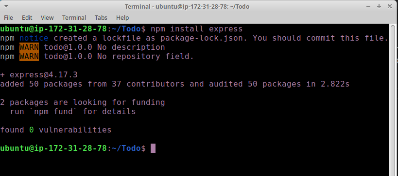

2. Now create a file index.js with the command below
`touch index.js`
 Run ls to confirm that your index.js file is successfully created
 `ls`

 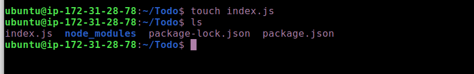

3. Install the dotenv module. run `npm install dotenv`

  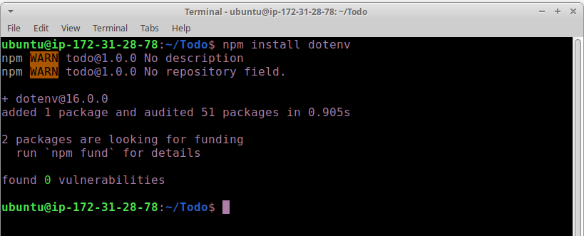

4. Open the index.js file with the command below
`vim index.js`

5. Type the code below into it and save. Do not get overwhelmed by the code you see. For now, simply paste the code into the file.

const express = require('express');
require('dotenv').config();

const app = express();

const port = process.env.PORT || 5000;

app.use((req, res, next) => {
res.header("Access-Control-Allow-Origin", "\*");
res.header("Access-Control-Allow-Headers", "Origin, X-Requested-With, Content-Type, Accept");
next();
});

app.use((req, res, next) => {
res.send('Welcome to Express');
});

app.listen(port, () => {
console.log(`Server running on port ${port}`)
});

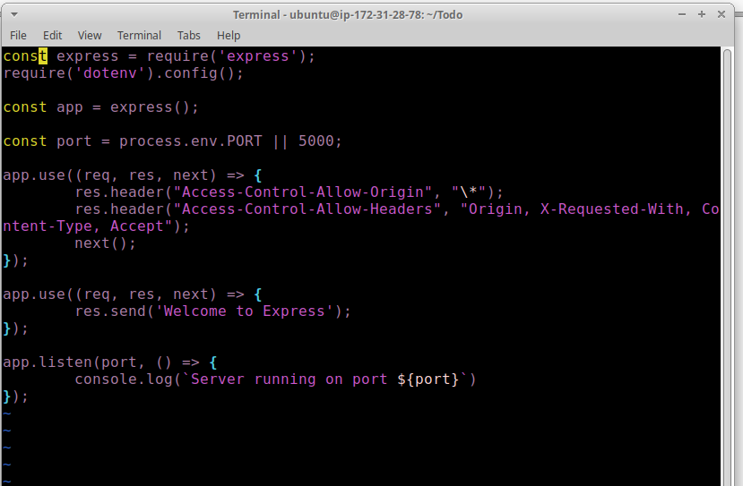

Notice that we have specified to use port 5000 in the code. This will be required later when we go on the browser.

Use :w to save in vim and use :qa to exit vim

6. Now it is time to start our server to see if it works. Open your terminal in the same directory as your index.js file and type:

`node index.js`

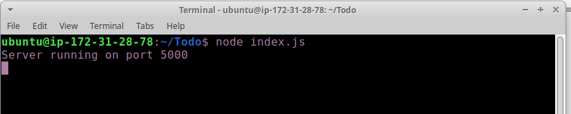

7. Now we need to open this port in EC2 Security Groups. Refer to Project 1 Step 1 – Installing the Nginx Web Server. There we created an inbound rule to open TCP port 80, you need to do the same for port 5000, like this:

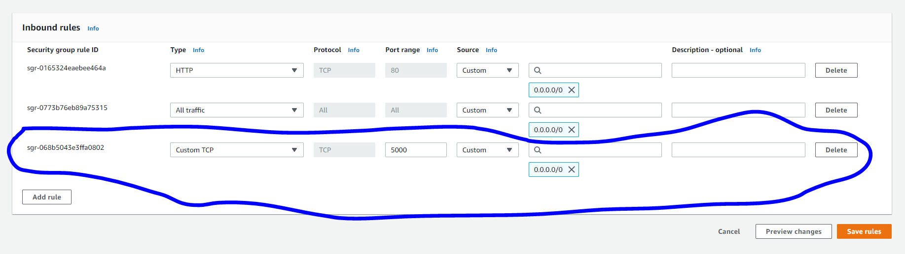

8. Open up your browser and try to access your server’s Public IP or Public DNS name followed by port 5000:

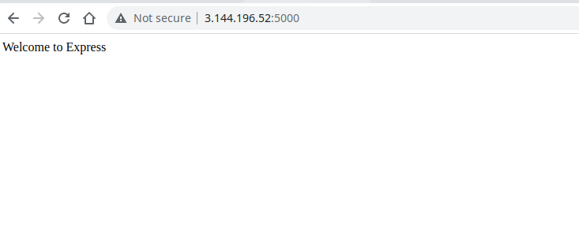

## Routes

- There are three actions that our To-Do application needs to be able to do:

a. Create a new task
b. Display list of all tasks
c. Delete a completed task

- Each task will be associated with some particular endpoint and will use different standard HTTP request methods: POST, GET, DELETE.

For each task, we need to create routes that will define various endpoints that the To-do app will depend on

9. So let us create a folder routes `mkdir routes`

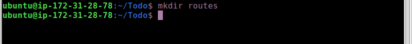

10. Change directory to routes folder. `cd routes`

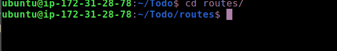

11. Now, create a file api.js with the command below. run `touch api.js`

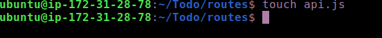

12. Open the file with the command below
`vim api.js`

13. Copy below code in the file. (Do not be overwhelmed with the code)

const express = require ('express');
const router = express.Router();

router.get('/todos', (req, res, next) => {

});

router.post('/todos', (req, res, next) => {

});

router.delete('/todos/:id', (req, res, next) => {

})

module.exports = router;

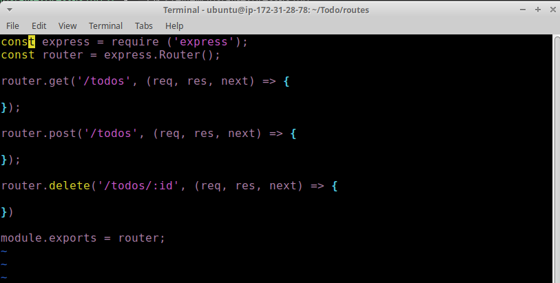

### Moving forward let create Models directory.

