# MONGODB DATABASE

We need a database where we will store our data. For this we will make use of mLab. mLab provides MongoDB database as a service solution (DBaaS), so to make life easy, you will need to sign up for a shared clusters free account, which is ideal for our use case. Sign up here. Follow the sign up process, select AWS as the cloud provider, and choose a region near you.

1. Complete a get started checklist as shown on the website
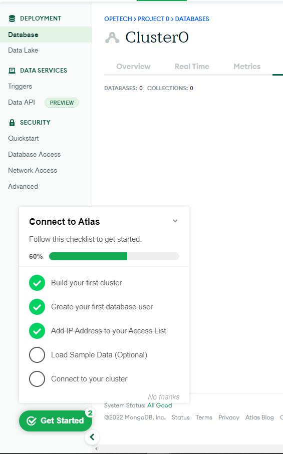

2. Allow access to the MongoDB database from anywhere (Not secure, but it is ideal for testing)

IMPORTANT NOTE
In the image below, make sure you change the time of deleting the entry from 6 Hours to 1 Week

3. Create a MongoDB database and collection inside mLab
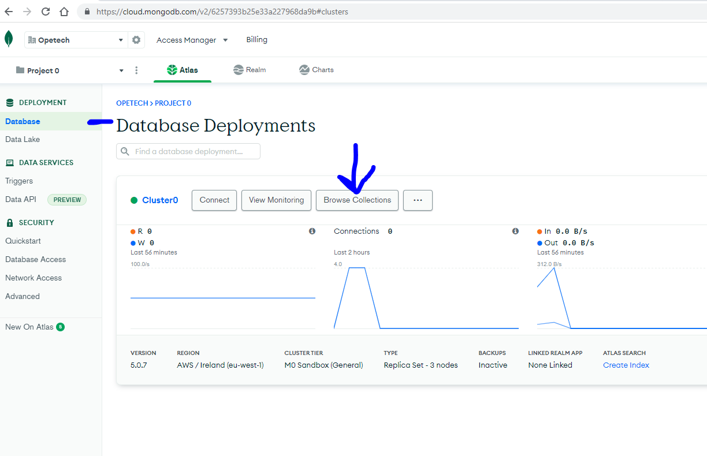

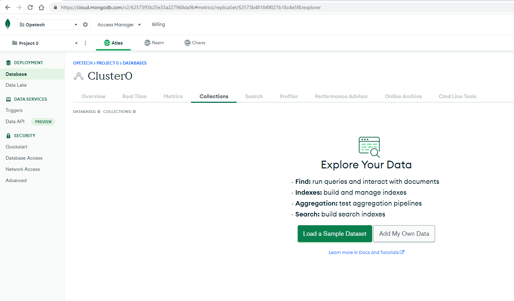

4. In the index.js file, we specified process.env to access environment variables, but we have not yet created this file. So we need to do that now.

Create a file in your Todo directory and name it .env.

run `touch .env`
`vi .env`
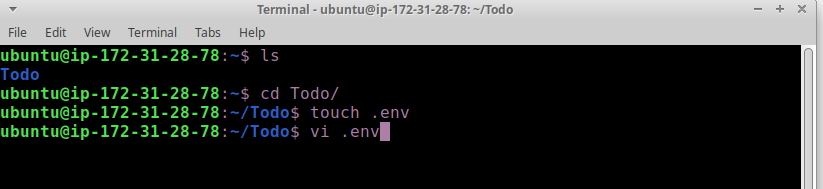

5. Add the connection string to access the database in it, just as below:

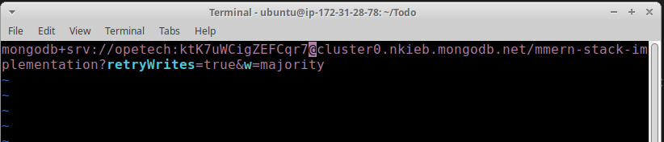

6. Now we need to update the index.js to reflect the use of .env so that Node.js can connect to the database.

- Simply delete existing content in the file, and update it with the entire code below.

To do that using vim, follow below steps

[x] Open the file with run `vim index.js`

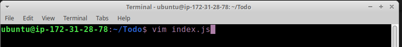

[x] Press esc
[x] Type :

[x] Type %d

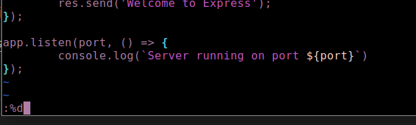
[x] Hit ‘Enter’
[x] The entire content will be deleted, then,

[x] Press i to enter the insert mode in vim
[x] Now, paste the entire code below in the file.

const express = require('express');
const bodyParser = require('body-parser');
const mongoose = require('mongoose');
const routes = require('./routes/api');
const path = require('path');
require('dotenv').config();

const app = express();

const port = process.env.PORT || 5000;

//connect to the database
mongoose.connect(process.env.DB, { useNewUrlParser: true, useUnifiedTopology: true })
.then(() => console.log(`Database connected successfully`))
.catch(err => console.log(err));

//since mongoose promise is depreciated, we overide it with node's promise
mongoose.Promise = global.Promise;

app.use((req, res, next) => {
res.header("Access-Control-Allow-Origin", "\*");
res.header("Access-Control-Allow-Headers", "Origin, X-Requested-With, Content-Type, Accept");
next();
});

app.use(bodyParser.json());

app.use('/api', routes);

app.use((err, req, res, next) => {
console.log(err);
next();
});

app.listen(port, () => {
console.log(`Server running on port ${port}`)
});

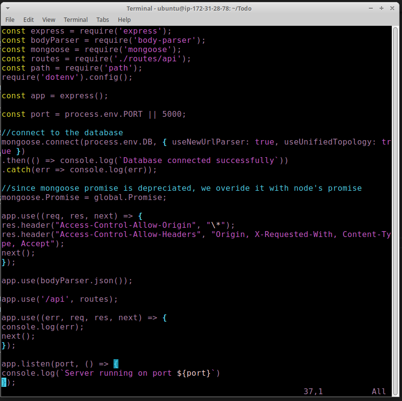

#### Using environment variables to store information is considered more secure and best practice to separate configuration and secret data from the application, instead of writing connection strings directly inside the index.js application file

7. Start your server using the command:

`node index.js`

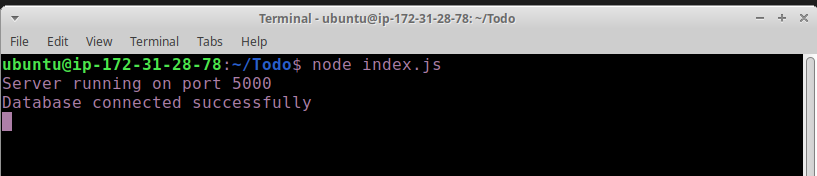

You shall see a message ‘Database connected successfully’, if so – we have our backend configured. Now we are going to test it.

### Testing Backend Code without Frontend using RESTful API

- So far we have written backend part of our To-Do application, and configured a database, but we do not have a frontend UI yet. We need ReactJS code to achieve that. But during development, we will need a way to test our code using RESTfulL API. Therefore, we will need to make use of some API development client to test our code.

- In this project, we will use Postman to test our API.

You should test all the API endpoints and make sure they are working. For the endpoints that require body, you should send JSON back with the necessary fields since it’s what we setup in our code.

Now open your Postman, create a POST request to the API http://<PublicIP-or-PublicDNS>:5000/api/todos. This request sends a new task to our To-Do list so the application could store it in the database.

[x] Note: make sure your set header key Content-Type as application/json

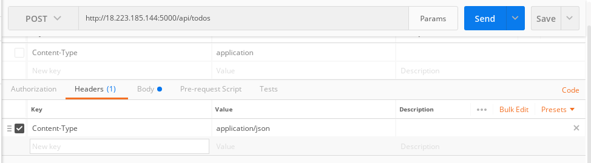

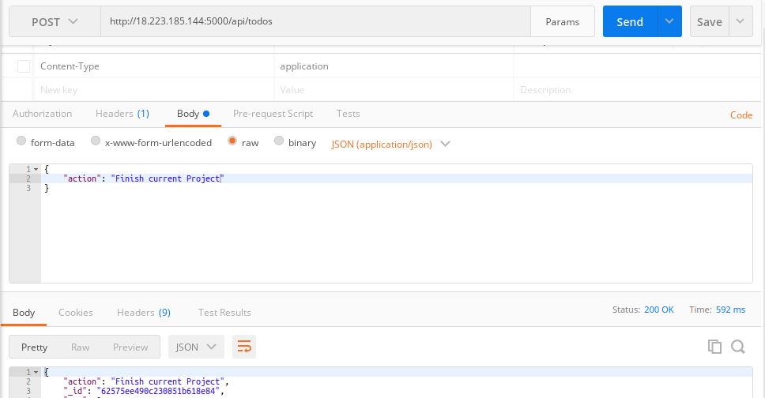

Create a GET request to your API on http://<PublicIP-or-PublicDNS>:5000/api/todos. This request retrieves all existing records from out To-do application (backend requests these records from the database and sends it us back as a response to GET request).

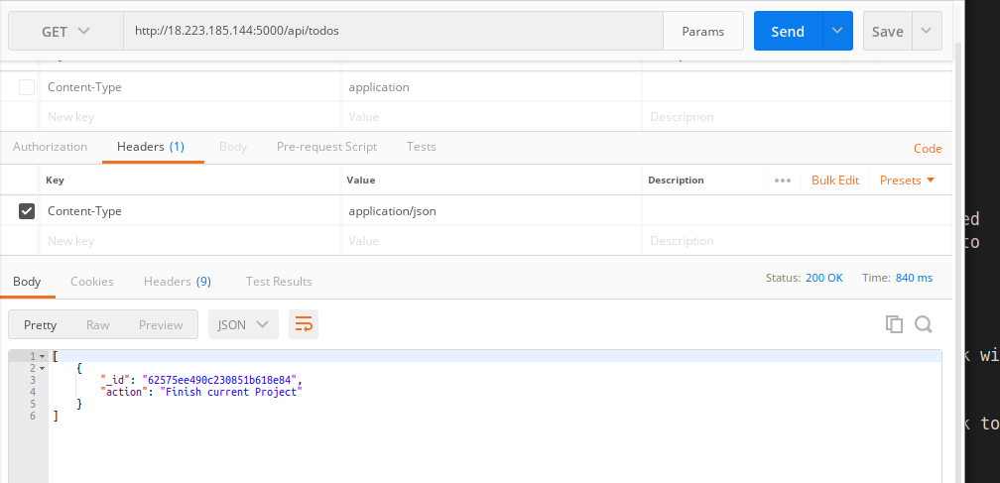

### Optional task: Try to figure out how to send a DELETE request to delete a task from out To-Do list.

- Delete request

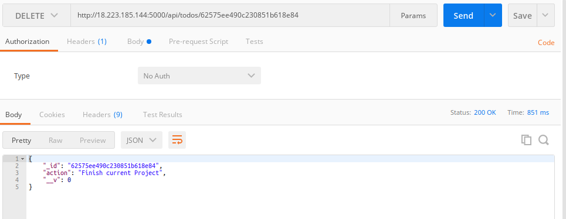
