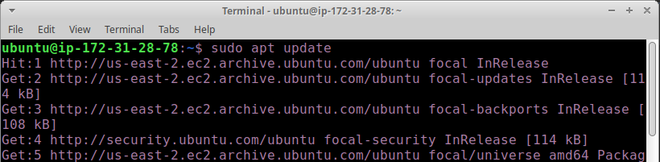
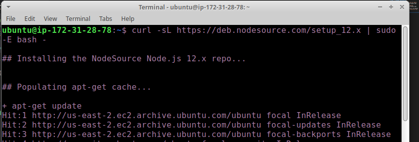
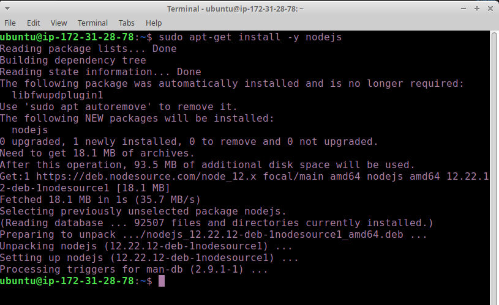
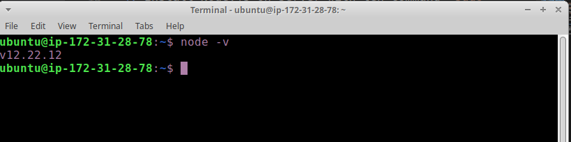
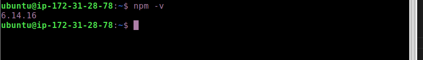
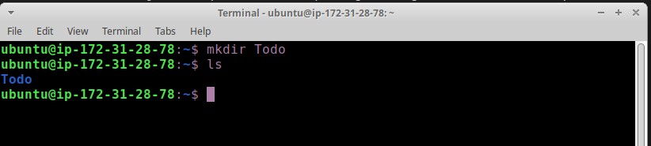
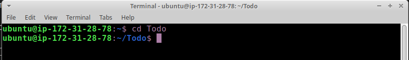
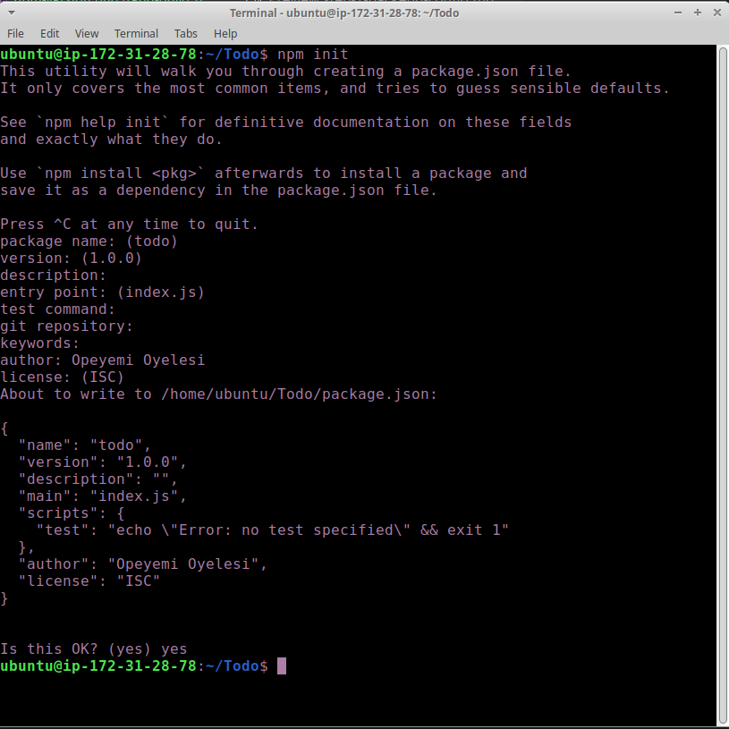
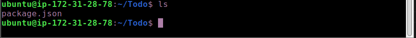

# STEP 1 – BACKEND CONFIGURATION

1.Update package managers by running `sudo apt update`

2. Upgrade Ubuntu by running `sudo apt upgrade`

3. Lets get the location of Node.js software from Ubuntu repositories. run `curl -sL https://deb.nodesource.com/setup_12.x | sudo -E bash -`

4. Install Node.js on server with teh command `sudo apt-get install -y nodejs`

5. Note: The command above installs both nodejs and npm. NPM is a package manager for Node like apt for Ubuntu, it is used to install Node modules & packages and to manage dependency conflicts.

Verify the node installation with the command below. run `node -v `

6. Verify npm installation with the command `npm -v `
 

7. Create a new directory for your To-Do project:`mkdir Todo`

8. Verify that the directory has been created by running `ls`
  

9. Navigate/change into the Todo directory by running `cd Todo`

10. Next, you will use the command npm init to initialise your project, so that a new file named package.json will be created. This file will normally contain information about your application and the dependencies that it needs to run. Follow the prompts after running the command. You can press Enter several times to accept default values, then accept to write out the package.json file by typing yes.

run `npm init`

11. Run the command ls to confirm that you have package.json file created. run `ls`

#### Next, we will Install ExpressJs and create the Routes directory.
